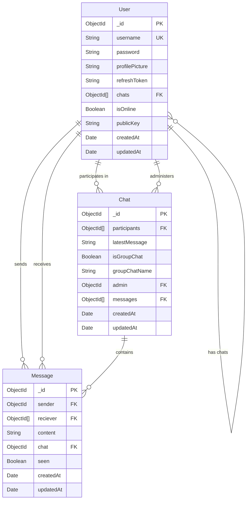

# Chat Application Database Diagram

## Database Schema Overview

## Detailed Model Descriptions

### 1. User Model
**Collection**: `users`

| Field | Type | Required | Description |
|-------|------|----------|-------------|
| `_id` | ObjectId | Yes | Primary key, auto-generated |
| `username` | String | Yes | Unique username for login |
| `password` | String | Yes | Encrypted password using bcrypt |
| `profilePicture` | String | No | URL to user's profile picture |
| `refreshToken` | String | No | JWT refresh token for authentication |
| `chats` | ObjectId[] | No | Array of chat IDs the user participates in |
| `isOnline` | Boolean | No | User's online status (default: false) |
| `publicKey` | String | No | Public key for encryption |
| `createdAt` | Date | Yes | Auto-generated timestamp |
| `updatedAt` | Date | Yes | Auto-updated timestamp |

**Methods**:
- `isPasswordCorrect(password)`: Compares password with stored hash
- `generateAccessToken()`: Creates JWT access token
- `generateRefreshToken()`: Creates JWT refresh token

### 2. Chat Model
**Collection**: `chats`

| Field | Type | Required | Description |
|-------|------|----------|-------------|
| `_id` | ObjectId | Yes | Primary key, auto-generated |
| `participants` | ObjectId[] | Yes | Array of user IDs in the chat |
| `latestMessage` | String | No | Content of the most recent message |
| `isGroupChat` | Boolean | No | Whether it's a group chat (default: false) |
| `groupChatName` | String | No | Name of the group chat |
| `admin` | ObjectId | No | User ID of group admin |
| `messages` | ObjectId[] | No | Array of message IDs in the chat |
| `createdAt` | Date | Yes | Auto-generated timestamp |
| `updatedAt` | Date | Yes | Auto-updated timestamp |

### 3. Message Model
**Collection**: `messages`

| Field | Type | Required | Description |
|-------|------|----------|-------------|
| `_id` | ObjectId | Yes | Primary key, auto-generated |
| `sender` | ObjectId | Yes | User ID who sent the message |
| `reciever` | ObjectId[] | Yes | Array of user IDs who receive the message |
| `content` | String | Yes | Message content |
| `chat` | ObjectId | No | Chat ID this message belongs to |
| `seen` | Boolean | No | Whether message has been seen (default: false) |
| `createdAt` | Date | Yes | Auto-generated timestamp |
| `updatedAt` | Date | Yes | Auto-updated timestamp |

## Relationships

### One-to-Many Relationships
1. **User → Chat**: A user can participate in multiple chats
2. **User → Message**: A user can send multiple messages
3. **Chat → Message**: A chat can contain multiple messages

### Many-to-Many Relationships
1. **User ↔ Chat**: Users participate in chats (through participants array)
2. **User ↔ Message**: Users receive messages (through receiver array)

### Special Relationships
1. **User → Chat (Admin)**: A user can be an admin of multiple group chats
2. **User → Chat (Chats Array)**: Users have a reference to their chats

## Indexes
- `users.username`: Unique index
- `users._id`: Primary key index
- `chats._id`: Primary key index
- `messages._id`: Primary key index
- `messages.sender`: Index for querying messages by sender
- `messages.chat`: Index for querying messages by chat

## Data Flow
1. **User Registration**: Creates user document with encrypted password
2. **Chat Creation**: Creates chat document with participants
3. **Message Sending**: Creates message document linked to sender, receivers, and chat
4. **Message Reading**: Updates message seen status

## Security Features
- Password encryption using bcrypt
- JWT token-based authentication
- Refresh token mechanism
- Public key encryption support 